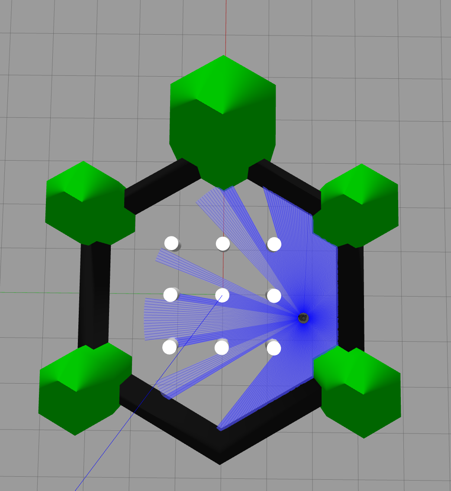
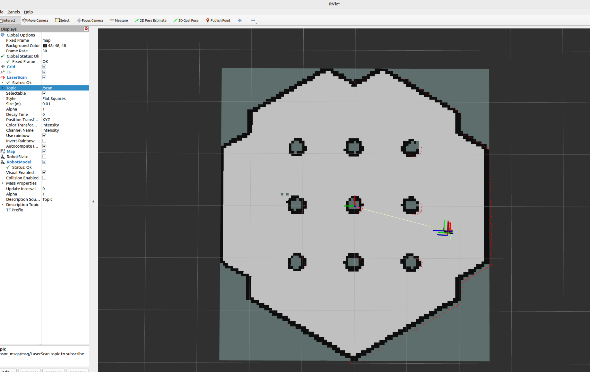
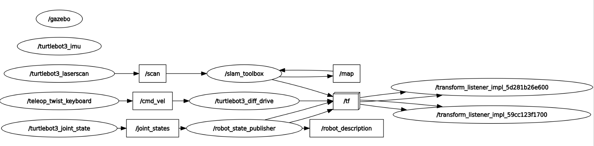

# Multi-Robot SLAM Research Log

## Day 02 - SLAM Toolbox Mapping with TurtleBot3

**Date:** 2026-06-24

---

# Objective

To understand the ROS2-based SLAM pipeline by generating a 2D occupancy grid map using TurtleBot3, Gazebo, RViz2, and SLAM Toolbox.

ROS2 환경에서 TurtleBot3, Gazebo, RViz2, SLAM Toolbox를 활용하여 2D Occupancy Grid Map을 생성하고 SLAM 데이터 흐름을 이해하는 것을 목표로 한다.

### 2D Occupancy Grid Map

A map representation that divides an environment into grid cells and classifies each cell as free, occupied, or unknown.

환경을 격자 형태로 분할하여 각 셀을 이동 가능 공간, 장애물, 또는 미탐색 영역으로 표현하는 지도 방식이다.

---

# Environment

| Item | Description |
|--------|--------|
| OS | Ubuntu 22.04 |
| ROS | ROS2 Humble |
| Simulator | Gazebo 11 |
| Robot | TurtleBot3 Burger |
| Mapping | SLAM Toolbox |
| Visualization | RViz2 |
| Platform | VMware |

---

# Procedure

## 1. Launch TurtleBot3 Gazebo

```bash
export TURTLEBOT3_MODEL=burger

export GAZEBO_RESOURCE_PATH=/usr/share/gazebo-11:$GAZEBO_RESOURCE_PATH

ros2 launch turtlebot3_gazebo turtlebot3_world.launch.py
```

### Purpose

Launch the TurtleBot3 simulation environment and verify sensor topics.

TurtleBot3 시뮬레이션 환경을 실행하고 센서 토픽 발행 여부를 확인한다.

---

## 2. Launch SLAM Toolbox

```bash
ros2 launch slam_toolbox online_async_launch.py
```

### Purpose

Generate a map while simultaneously estimating the robot pose.

로봇의 위치를 추정하면서 동시에 지도를 생성한다.

### Meaning of online_async

- **online** : Perform SLAM in real time while the robot is moving.
- **async** : Process incoming sensor data asynchronously.

- **online** : 로봇이 이동하는 동안 실시간으로 SLAM 수행
- **async** : 센서 데이터를 비동기적으로 처리

### Observation

SLAM Toolbox successfully registered the LiDAR sensor and started publishing the `/map` topic.

SLAM Toolbox가 LiDAR 센서를 정상적으로 등록하고 `/map` 토픽을 발행하기 시작하였다.

---

## 3. Launch RViz2

```bash
rviz2
```

### Added Displays

- **Map** (Visualize the occupancy grid map generated by SLAM Toolbox / SLAM Toolbox가 생성한 Occupancy Grid Map 시각화)
- **LaserScan** (Visualize raw LiDAR measurements from `/scan` / LiDAR 원본 데이터 시각화)
- **TF** (Visualize coordinate frames and transformations / 좌표계(Frame) 및 좌표 변환 관계 시각화)
- **RobotModel** (Visualize the robot model defined in URDF / URDF 기반 로봇 모델 시각화)

### Purpose

Visualize mapping results, sensor data, robot model, and coordinate transforms.

지도 생성 결과, 센서 데이터, 로봇 모델, 좌표계 변환 정보를 시각화한다.

---

## 4. Teleoperation

```bash
ros2 run teleop_twist_keyboard teleop_twist_keyboard
```

### Purpose

Control TurtleBot3 manually and explore the environment.

TurtleBot3를 수동으로 조종하여 환경을 탐색한다.

---

# Experimental Results

## Figure 1. Gazebo Environment and LiDAR Visualization



**English**

TurtleBot3 operating in the Gazebo simulation environment. Blue laser beams represent LiDAR measurements used for obstacle detection and SLAM.

**한국어**

Gazebo 시뮬레이션 환경에서 동작하는 TurtleBot3. 파란색 레이저는 장애물 인식 및 SLAM에 사용되는 LiDAR 측정값을 나타낸다.

---

## Figure 2. Occupancy Grid Map Generated by SLAM Toolbox



**English**

Occupancy Grid Map generated by SLAM Toolbox using LiDAR and odometry data. Black regions represent occupied cells, white regions represent free space, and gray regions indicate unexplored areas.

**한국어**

SLAM Toolbox가 LiDAR 및 Odometry 데이터를 이용하여 생성한 Occupancy Grid Map. 검은색은 장애물, 흰색은 이동 가능한 공간, 회색은 미탐색 영역을 의미한다.

---

## Figure 3. ROS2 Communication Graph



**English**

ROS2 communication architecture visualized using rqt_graph. The graph illustrates the data flow between sensor plugins, topics, SLAM Toolbox, and robot control nodes.

**한국어**

rqt_graph를 이용하여 시각화한 ROS2 통신 구조. 센서 플러그인, 토픽, SLAM Toolbox, 로봇 제어 노드 간의 데이터 흐름을 나타낸다.

---

# ROS Graph Analysis

### Observed Data Flow

```text
teleop_twist_keyboard
        ↓
      /cmd_vel
        ↓
turtlebot3_diff_drive
        ↓
      Robot Motion

turtlebot3_laserscan
        ↓
       /scan
        ↓
    slam_toolbox
        ↓
        /map
        ↓
       RViz2

joint_states
        ↓
robot_state_publisher
        ↓
         /tf
```

### Key Understanding

ROS2 nodes communicate through topics.

ROS2 노드는 Topic을 통해 데이터를 주고받는다.

---

# Sensor Understanding

## LiDAR

### Topic

```text
/scan
```

### Purpose

Provides distance measurements to surrounding obstacles.

주변 장애물까지의 거리 정보를 제공한다.

### Used By

- SLAM Toolbox

---

## Odometry

### Topic

```text
/odom
```

### Purpose

Provides robot position and velocity estimated from wheel encoders.

바퀴 엔코더 기반의 위치 및 속도 정보를 제공한다.

### Used By

- SLAM Toolbox

---

## IMU

### Topic

```text
/imu
```

### Purpose

Provides angular velocity and linear acceleration measurements.

각속도 및 가속도 정보를 제공한다.

### Observation

The IMU topic was published but was not used by SLAM Toolbox in this experiment.

IMU 토픽은 발행되고 있었지만 본 실험의 SLAM Toolbox에서는 사용되지 않았다.

---

# TF (Transform) Understanding

### Definition

TF manages coordinate transformations between different reference frames.

TF는 서로 다른 좌표계 간의 변환 정보를 관리하는 ROS 시스템이다.

### Coordinate Frames

```text
map
 ↓
odom
 ↓
base_link
 ↓
base_scan
```

### Importance

SLAM Toolbox uses TF information to transform LiDAR measurements into map coordinates.

SLAM Toolbox는 LiDAR 데이터를 지도 좌표계로 변환하기 위해 TF 정보를 사용한다.

---

# Gazebo Plugin Understanding

### Definition

Gazebo Plugins connect simulated sensors and actuators to ROS2 topics.

Gazebo Plugin은 Gazebo의 가상 센서 및 액추에이터를 ROS2 토픽과 연결하는 모듈이다.

### Examples

| Plugin | ROS Topic |
|----------|----------|
| LiDAR Plugin | /scan |
| IMU Plugin | /imu |
| Diff Drive Plugin | /odom, /cmd_vel |
| Joint State Plugin | /joint_states |

### Key Understanding

The sensor data observed in ROS2 are generated by Gazebo Plugins.

ROS2에서 관측되는 센서 데이터는 Gazebo Plugin을 통해 생성된다.

---

# SLAM Toolbox Understanding

### Role

SLAM Toolbox simultaneously performs:

1. Localization
2. Mapping

SLAM Toolbox는 다음 두 작업을 동시에 수행한다.

1. 위치 추정
2. 지도 생성

### Inputs

```text
/scan
/odom
/tf
```

### Outputs

```text
/map
```

### Mapping Pipeline

```text
LiDAR
 ↓
/scan
 ↓
SLAM Toolbox
 ↓
Occupancy Grid Map
 ↓
/map
 ↓
RViz2
```

---

### Commands to Explore

```bash
ros2 run nav2_map_server map_saver_cli -f my_map

ros2 pkg list | grep nav2
```

---
